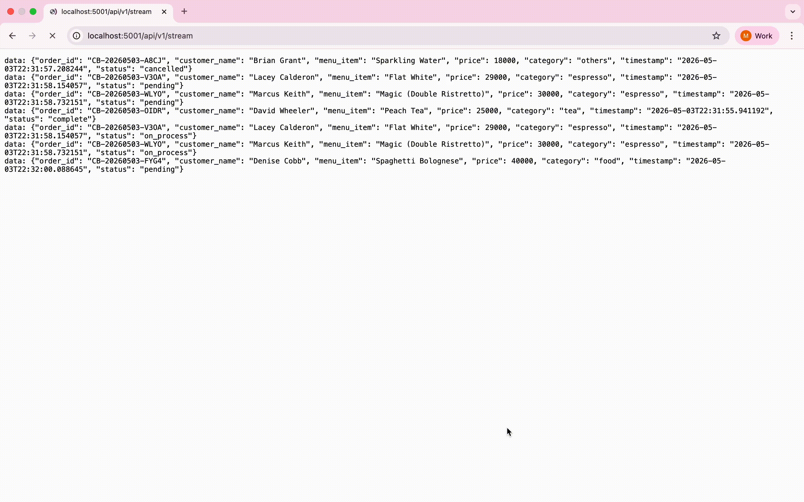

# 📡 Streaming API — Real-time Order Monitoring Demo
> Pipeline **Streaming API** berbasis **Server-Sent Events (SSE)** dan **WebSocket** untuk memantau event pesanan secara *real-time*, dibangun dengan PostgreSQL, Redis, Flask, dan Gradio.




---

## 📑 Daftar Isi
- [Gambaran Umum](#-gambaran-umum)
- [Arsitektur Sistem](#-arsitektur-sistem)
- [Alur Data (Flowchart)](#-alur-data-flowchart)
- [Struktur Proyek](#-struktur-proyek)
- [Teknologi yang Digunakan](#-teknologi-yang-digunakan)
- [Prasyarat](#-prasyarat)
- [Instalasi & Menjalankan](#-instalasi--menjalankan)
- [Konfigurasi Environment](#-konfigurasi-environment)
- [Penggunaan](#-penggunaan)
- [Endpoint API](#-endpoint-api)
- [Kontribusi](#-kontribusi)

---

## 🔍 Gambaran Umum
Streaming API adalah sistem pipeline data *real-time* yang mensimulasikan operasional sebuah coffee shop — mulai dari pembuatan pesanan, pemrosesan, hingga penyelesaian — dan menampilkannya secara langsung di sebuah dashboard interaktif.
Proyek ini mendemonstrasikan implementasi **Streaming API** menggunakan **Server-Sent Events (SSE)** dan **WebSocket**, dengan Redis sebagai message broker yang mempropagasikan setiap event pesanan secara *real-time* ke semua client yang terhubung. Coffee shop digunakan sebagai konteks simulasi data.
**Fitur Utama:**
- 🔄 Simulasi siklus hidup pesanan otomatis (`pending` → `on_process` → `complete` / `cancelled`)
- 📦 **Bulk Insert** dengan deduplication ke PostgreSQL (batch 100 record atau setiap 30 detik)
- 📡 Streaming data *real-time* via **Redis Pub/Sub** dan **Server-Sent Events (SSE)**
- 🖥️ Dashboard Gradio dengan KPI cards dan tabel pesanan terbaru
- 🔌 WebSocket support via Flask-SocketIO
- 📝 Structured JSON logging dengan rotasi file otomatis
- ♻️ Orchestrator dengan **auto-restart** jika ada komponen yang crash

---

## 🏛️ Arsitektur Sistem
```
┌─────────────────────────────────────────────────────────────────┐
│                        main.py (Orchestrator)                   │
│          Mengelola lifecycle semua komponen sebagai subprocess  │
└──────┬──────────┬──────────────────┬────────────────────────────┘
       │          │                  │
       ▼          ▼                  ▼
┌──────────┐ ┌──────────┐   ┌──────────────┐    ┌──────────────┐
│   Data   │ │ Listener │   │  Flask API   │    │  Dashboard   │
│Generator │ │(engine/) │   │  (api/)      │    │ (dashboard/) │
└────┬─────┘ └────┬─────┘   └──────┬───────┘    └──────┬───────┘
     │            │                │                   │
     │   LPUSH    │   RPOP (batch) │  SSE / WebSocket  │  HTTP GET
     │            │                │                   │
     └────────────▼────────────────┘                   │
              ┌──────┐                                 │
              │Redis │◄────────────────────────────────┘
              │(6379)│   Pub/Sub: coffee_orders_channel
              └──┬───┘
                 │ Pub/Sub → Flask → SSE → Dashboard
                 │
                 ▼
          ┌────────────┐
          │ PostgreSQL │  (WAL Level: logical, REPLICA IDENTITY FULL)
          │  (5432)    │  Table: orders (max 1000 rows via trigger)
          └────────────┘
```

**Penjelasan Flowchart:**
1. **`data_generator.py`** membuat pesanan baru setiap 0.5–1.5 detik menggunakan `ThreadPoolExecutor` (3 worker). Setiap pesanan melewati siklus: `pending` → `on_process` → `complete` (atau `cancelled` dengan probabilitas 20%).
2. Setiap event dikirim ke **dua channel Redis secara bersamaan**:
   - `LPUSH order_queue` → untuk bulk insert ke database
   - `PUBLISH coffee_orders_channel` → untuk streaming real-time ke API
3. **`listener.py`** mengonsumsi `order_queue` dari Redis. Data di-*buffer* dan di-*flush* ke PostgreSQL secara batch (100 record atau setiap 30 detik), dengan deduplication berdasarkan `order_id`.
4. **`api/app.py`** (Flask) subscribe ke `coffee_orders_channel` dan mengekspos data melalui SSE (`/api/v1/stream`) dan WebSocket.
5. **`dashboard/main.py`** (Gradio) mengonsumsi SSE stream dari Flask API, memperbarui KPI cards dan tabel pesanan secara otomatis.

---

## 🔀 Alur Data (Flowchart)
```
                    ┌─────────────────────┐
                    │   main.py START     │
                    │   (Orchestrator)    │
                    └──────────┬──────────┘
                               │ Spawn subprocess berurutan
          ┌────────────────────┼────────────────────┐
          ▼                    ▼                    ▼
   ┌─────────────┐    ┌──────────────┐    ┌──────────────┐
   │  listener   │    │   api/app    │    │  generator   │
   │  .py START  │    │   .py START  │    │  .py START   │
   └──────┬──────┘    └──────┬───────┘    └──────┬───────┘
          │                  │                   │
          │         ┌────────▼────────┐          │
          │         │  Subscribe ke   │          │
          │         │  Redis Pub/Sub  │          │
          │         │ coffee_orders   │          │
          │         │    _channel     │          │
          │         └────────┬────────┘          │
          │                  │                   │
          │                  │       ┌───────────▼────────────┐
          │                  │       │  Loop: buat pesanan    │
          │                  │       │  baru setiap 0.5–1.5s  │
          │                  │       └───────────┬────────────┘
          │                  │                   │
          │                  │       ┌───────────▼────────────┐
          │                  │       │  Set status = pending  │
          │                  │       └───────────┬────────────┘
          │                  │                   │
          │                  │       ┌───────────▼────────────┐
          │                  │       │  LPUSH ke order_queue  │◄──────────┐
          │                  │       │  PUBLISH ke channel    │           │
          │                  │       └───────────┬────────────┘           │
          │                  │                   │                        │
          │                  │       ┌───────────▼────────────┐           │
          │                  │       │  random.random() < 0.2 │           │
          │                  │       └───────────┬────────────┘           │
          │                  │             ┌─────┴──────┐                 │
          │                  │           YES             NO               │
          │                  │             │              │               │
          │                  │   ┌─────────▼──┐   ┌──────▼────────────┐   │
          │                  │   │ status =   │   │  status =         │   │
          │                  │   │ cancelled  │   │  on_process       │   │
          │                  │   └────────────┘   └──────┬────────────┘   │
          │                  │                           │                │
          │                  │                   ┌───────▼────────────┐   │
          │                  │                   │  status = complete │   │
          │                  │                   └───────┬────────────┘   │
          │                  │                           │                │
          │                  │                           └────────────────┘
          │                  │                           (repeat for next order)
          │                  │
   ┌──────▼──────┐           │
   │ RPOP dari   │           │
   │ order_queue │           │
   └──────┬──────┘           │
          │                  │
   ┌──────▼──────────────┐   │
   │  Tambah ke buffer   │   │
   │  (deduplication     │   │
   │   by order_id)      │   │
   └──────┬──────────────┘   │
          │                  │
   ┌──────▼──────────────────▼──┐
   │  buffer >= 100 records?    │
   │  ATAU timeout 30 detik?    │
   └──────┬─────────────────────┘
          │
     ┌────┴────┐
    YES        NO
     │          │
     ▼          └──► tunggu 0.5s, loop
┌────────────────────┐
│  Bulk INSERT ke    │
│  PostgreSQL        │
│  ON CONFLICT →     │
│  UPDATE (UPSERT)   │
└────────────────────┘
          │
   ┌──────▼──────┐
   │ Reset buffer│
   │ & timer     │
   └─────────────┘

=== FLASK API & DASHBOARD ===

┌────────────────────────────┐
│  Redis Pub/Sub message     │
│  (coffee_orders_channel)   │
└──────────┬─────────────────┘
           │
   ┌────────▼────────────┐
   │  Flask socketio     │
   │  emit('new_order')  │─────────────► WebSocket Clients
   └────────┬────────────┘
            │
   ┌────────▼────────────┐
   │  GET /api/v1/stream │
   │  (SSE endpoint)     │
   └────────┬────────────┘
            │
   ┌────────▼────────────┐
   │  transform.py       │
   │  DataTransformer    │
   │  (orders_cache      │
   │   by order_id)      │
   └────────┬────────────┘
            │
   ┌────────▼────────────┐
   │  Gradio Dashboard   │
   │  - KPI Cards        │
   │  - Orders Table     │
   │  (auto-refresh)     │
   └─────────────────────┘
```

---

## 📁 Struktur Proyek
```
streaming-api/
├── main.py                    # Orchestrator utama (mengelola semua subprocess)
├── docker-compose.yml         # Setup PostgreSQL & Redis via Docker
├── requirements.txt           # Dependensi Python
├── .env                       # Konfigurasi environment (buat sendiri, lihat bagian Konfigurasi)
│
├── engine/
│   ├── data_generator.py      # Simulasi transaksi coffee shop (Faker + ThreadPoolExecutor)
│   ├── listener.py            # Redis consumer → Bulk Insert ke PostgreSQL
│   ├── menu_coffeeshop.json   # Data menu (28 item, 5 kategori)
│   └── Dockerfile             # Docker image untuk engine
│
├── api/
│   ├── app.py                 # Flask API dengan SSE & WebSocket (Flask-SocketIO)
│   └── Dockerfile             # Docker image untuk API
│
├── dashboard/
│   ├── main.py                # Gradio dashboard (KPI + tabel real-time)
│   ├── transform.py           # DataTransformer: SSE consumer → DataFrame
│   └── Dockerfile             # Docker image untuk dashboard
│
├── postgres/
│   └── init.sql               # DDL tabel, trigger limit 1000 baris, publikasi CDC
│
└── utils/
    └── logger.py              # Structured JSON logging dengan rotasi file
```

---

## 🛠️ Teknologi yang Digunakan
| Komponen | Teknologi | Versi | Fungsi |
|---|---|---|---|
| Database | PostgreSQL | 15 | Penyimpanan pesanan + CDC via WAL logical |
| Message Broker | Redis | 7 | Queue (List) + Pub/Sub real-time |
| API Server | Flask + Flask-SocketIO | 3.x | SSE & WebSocket endpoint |
| Dashboard | Gradio | 4.x | UI monitoring interaktif |
| Data Generation | Faker | 24.x | Simulasi nama pelanggan |
| Containerization | Docker Compose | — | Infrastruktur PostgreSQL & Redis |
| Language | Python | 3.9+ | Semua komponen backend |

---

## ✅ Prasyarat
Sebelum memulai, pastikan sudah terinstal:
- [Python 3.9+](https://www.python.org/downloads/)
- [Docker & Docker Compose](https://docs.docker.com/get-docker/)
- `pip` (Python package manager)

---

## 🚀 Instalasi & Menjalankan
### 1. Clone Repository
```bash
git clone https://github.com/alandhar/streaming-api.git
cd streaming-api
```
### 2. Buat File Environment
```bash
cp .env.example .env
# Edit .env sesuai konfigurasi Anda (lihat bagian Konfigurasi)
```
### 3. Jalankan Infrastruktur (PostgreSQL + Redis)
```bash
docker compose up -d
```
Tunggu hingga kedua service sehat:
```bash
docker compose ps
# Status: healthy
```
### 4. Install Dependensi Python
```bash
pip install -r requirements.txt
```
### 5. Jalankan Aplikasi
**Mode standar** (tanpa dashboard Gradio):
```bash
python main.py
```
**Mode lengkap** (termasuk Gradio dashboard):
```bash
python main.py --dashboard
```
**Mode tanpa generator** (input data manual):
```bash
python main.py --no-generator
```
**Kombinasi:**
```bash
python main.py --dashboard --no-generator
```
### 6. Akses Dashboard
Setelah semua komponen berjalan:
| Service | URL |
|---|---|
| Gradio Dashboard | http://localhost:7860 |
| Flask API | http://localhost:5001 |
| SSE Stream | http://localhost:5001/api/v1/stream |
| Health Check | http://localhost:5001/api/v1/health |

---

## ⚙️ Konfigurasi Environment
Buat file `.env` di root proyek dengan isi berikut:
```env
# PostgreSQL
DB_HOST=localhost
DB_PORT=5432
DB_NAME=mydb
DB_USER=postgres
DB_PASSWORD=your_password_here
# Redis
REDIS_HOST=localhost
REDIS_PORT=6379
# API (untuk dashboard/transform.py)
URL_API=http://localhost:5001/api/v1/stream
```
> ⚠️ **Penting**: Nilai `DB_NAME`, `DB_USER`, dan `DB_PASSWORD` di `.env` harus konsisten dengan yang digunakan di `docker-compose.yml`.

---

## 📖 Penggunaan
### Menjalankan dengan Flag
| Flag | Deskripsi |
|---|---|
| *(tanpa flag)* | Jalankan listener + API + generator |
| `--dashboard` | Tambahkan Gradio dashboard |
| `--no-generator` | Lewati data generator (untuk input manual) |
### Menghentikan Aplikasi
Tekan `Ctrl+C`. Orchestrator akan mengirim `SIGTERM` ke semua subprocess dan menunggu graceful shutdown selama 5 detik sebelum force-kill.
### Melihat Log
Log disimpan dalam format JSON di folder `logs/`:
```bash
logs/
├── main.json.log
├── listener.json.log
├── data_generator.json.log
├── app.json.log
└── main.json.log   # dashboard
```

---

## 🔌 Endpoint API
### `GET /api/v1/health`
Cek status layanan.
**Response:**
```json
{
  "status": "healthy",
  "version": "1.0.0",
  "service": "coffee-streaming-api"
}
```
### `GET /api/v1/stream`
Server-Sent Events (SSE) stream untuk data pesanan real-time.
**Response (event stream):**
```
data: {"order_id": "CB-20240503-AB12", "customer_name": "Budi Santoso", "menu_item": "Iced Latte", "price": 30000, "category": "iced_coffee", "status": "complete", "timestamp": "2024-05-03T10:23:45.123456"}
data: {"order_id": "CB-20240503-XY99", ...}
```
**Contoh konsumsi dengan curl:**
```bash
curl -N http://localhost:5001/api/v1/stream
```
**Contoh konsumsi dengan Python:**
```python
import requests
response = requests.get("http://localhost:5001/api/v1/stream", stream=True)
for line in response.iter_lines():
    if line and line.startswith(b"data: "):
        print(line.decode()[6:])
```
### WebSocket
Tersedia di `ws://localhost:5001` menggunakan Socket.IO.
**Event:** `new_order` — payload sama dengan format SSE di atas.

---

## 🗄️ Skema Database
```sql
CREATE TABLE orders (
    id            SERIAL PRIMARY KEY,
    order_id      VARCHAR(20) UNIQUE,
    customer_name VARCHAR(100),
    menu_item     VARCHAR(100),
    price         INT,
    category      VARCHAR(50),
    status        VARCHAR(20),
    created_at    TIMESTAMP DEFAULT NOW(),
    updated_at    TIMESTAMP DEFAULT NOW()
);
```
> **Catatan:** Database secara otomatis membatasi jumlah baris di tabel `orders` pada **1.000 baris terbaru** via trigger PostgreSQL.

---

## 🤝 Kontribusi
Kontribusi sangat disambut! Silakan:
1. Fork repository ini
2. Buat branch fitur baru (`git checkout -b feature/nama-fitur`)
3. Commit perubahan (`git commit -m 'feat: tambah fitur X'`)
4. Push ke branch (`git push origin feature/nama-fitur`)
5. Buka Pull Request

---

<div align="center">
<sub>Dibuat dengan ☕ dan Python</sub>
</div>